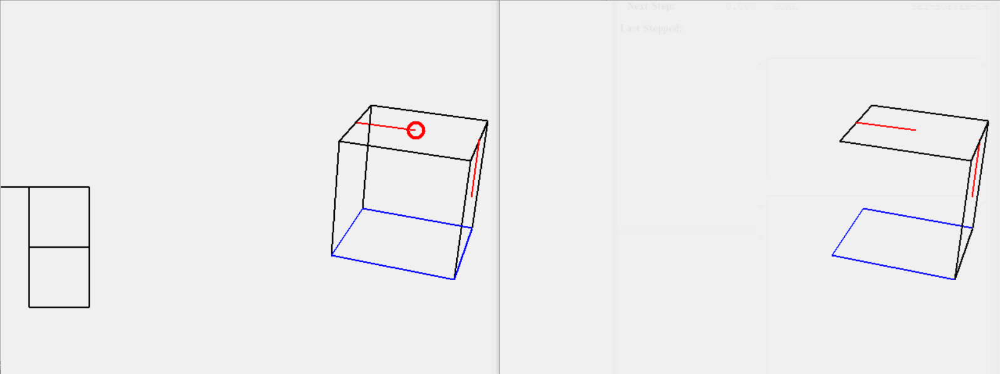

# Cognitive Model for a Mental Folding Task

A simulated replication of the experiment and a cognitive model solving the mental folding task. The model was formalised and implemented in ACT-R, based on cognitive processes theorised by Shepard and Feng (1972). Like the mental rotation model, it followed an outline proposed by Just and Carpenter (1976) comprised of visual encoding, transformation and comparison, and motor response.

Discussed in scientific papers: (ETRA'20 Adjunct: ACM Symposium on Eye Tracking Research and Applications)[https://dl.acm.org/doi/10.1145/3379157.3391415]

Reupload for portfolio purposes. Originally uploaded in 2023 at <https://doi.org/10.14279/depositonce-19515>.
